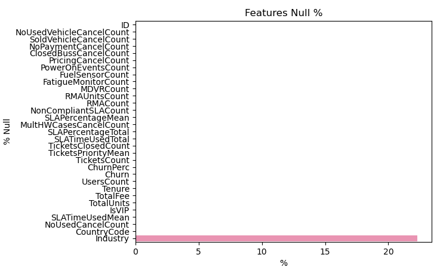
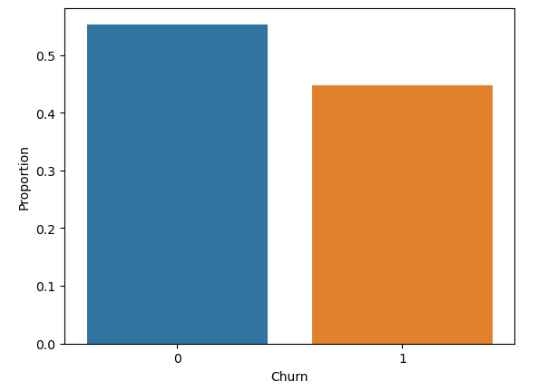
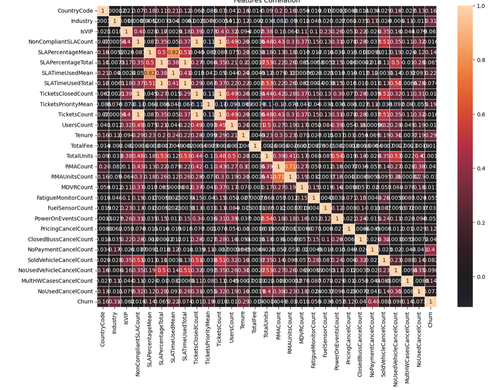
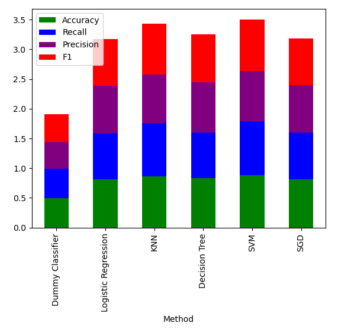
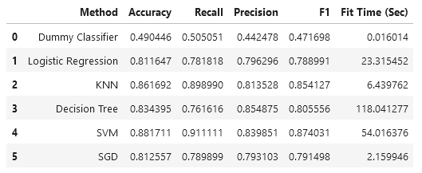
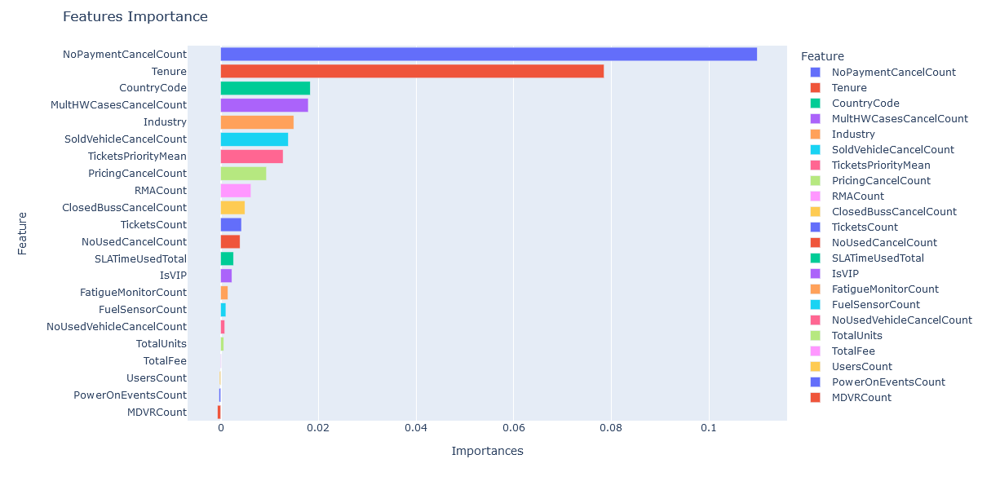
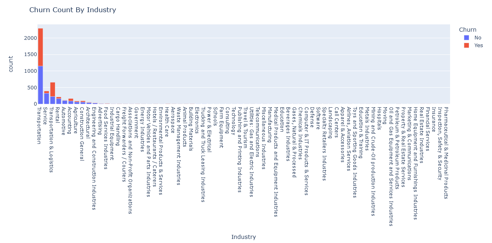

# Capstone Company-Churn

### Business Understanding: ###

How can I predict whether or not a customer will cancel the service offered in the company where I work (I work in a geolocation services company)?

### Data: ###

The data I am using is obtained directly from the CRM application that the company has, among that data we have information on complaints and claims, RMA and support cases of each customer.

The data can be found in this link

[FullChurn.csv](https://github.com/camorante/Company-Churn/tree/main/data/FullChurn.csv)

### Notebook Link ###

The following notebook contains all the development of the analysis carried out.

[Capstone.ipynb](https://github.com/camorante/Company-Churn/blob/main/Capstone.ipynb)

### The techniques and Analysis ###

1 Collect client data from the current date up to two years ago. Filter the characteristics through correlation diagrams.

2 Perform a cleaning of the information in order to eliminate redundant data and outliers. 

3 Train classification model as baseline to have a point of comparison.

4 Train KNN, Logistic regression, Decision tree and SVM models in search of the best one. Oversampling techniques will be used (SMOTE, ADASYN) and neural networks will not be used since the number of records is not very large.

5 Once the model has been found, debugged and improved a version 1.0 will be deployed in production for use by the customer service area.

### Data Understanding ###

1 **ID**: Unique identification code of the company.
2 **IsVIP**: Indicates if the customer is a VIP.
3 **CountryCode**: Customer's Country Code
4 **TotalUnits**: Number of GPS units purchased by the customer.
5 **TotalFee**: Total charge for the service provided in USD dollars.
6 **Industry**: Industry to which the customer belongs
7 **Tenure**: customer's tenure in months
8 **UsersCount**: count of users that the customer has on the platform
9 **Churn**: Target variable, 1: Churn, 0: Not Churn
10 **ChurnPerc**: Percentage of units in Churn
11 **TicketsCount**: Count of support cases to date
12 **TicketsPriorityMean**: Average priority of support cases(1: low, 2: normal, 3: high)
13 **TicketsClosedCount**: count of closed support cases
14 **SLATimeUsedTotal**: Total SLA Time Used which is the result of the sum of the SLA time of each case (each case has a maximum time of attention)
15 **SLATimeUsedMean**: Average SLA time for all customer's cases
16 **SLAPercentageTotal**: Total percentage which is a result of the sum of the SLA percentage spent on each case (a case that exceeds 100% of SLA is that it exceeded the maximum total time previously set for that case)
17 **SLAPercentageMean**: Average percentage of SLA use
18 **NonCompliantSLACount**: Count of cases that did not comply with the SLA
19 **RMACount**: Count of cases returned to manufacturer for each customer in case of warranty
20 **RMAUnitsCount**: Count of units returned to the manufacturer for each customer
21 **MDVRCount**: Count of MDVR cameras owned by customer
22 **FatigueMonitorCount**: Count of fatigue/drowsiness sensors owned by customer 
23 **FuelSensorCount**: Count of fuel sensors owned by the customer 
24 **PowerOnEventsCount**: Count of power on/off events of the GPS units owned by the customer
25 **PricingCancelCount**: Count of requests for cancellation of customer's units for reasons of too high price of the service.
26 **ClosedBussCancelCount**: Count of cancellation requests from the customer for reasons of business closure or bankruptcy.
27 **NoPaymentCancelCount**: Count of customer's unit cancellation requests due to non-payment of invoices.
28 **SoldVehicleCancelCount**: Count of requests for cancellation of customer's units due to sale of vehicles
29 **NoUsedVehicleCancelCount**: Count of customer's unit cancellation requests due to unused vehicles
30 **MultHWCasesCancelCount**: Count of customer's unit cancellation requests due to hardware problems in units
31 **NoUsedCancelCount**: Count of customer's unit cancellation requests due to units not being used by customer

### Data Preparation and Cleaning ###

Industry and Countrycode have nulls which we will impute in order to fill these null values.

#### Correlations and Imbalance: ####

The dataset has some imbalance but it is possible to correct it later with oversampling.

Some features with a correlation = 1 are removed.

### Models ###

For the training I used 4 different models in order to find the most optimal one (A dummy classifier will be used as a baseline reference model):

* Logistic Regression
* KNN
* Decision Tree
* SVM
* SGDClassifier

I am also using oversampling(adasyn or smote) and GridSearchCV as cross validation.

### Model Evaluation ###

As can be seen in the score values for each model, SVC has one of the best scores among the others, followed by KNN which is very close behind. SVC performs well and seems to be the most suitable to use for the company's forecasts.

### Feature Importances

As a main feature we have that the NoPaymentCancelCount feature has a lot of weight when predicting churn followed by tenure, this is probably due to the fact that non-payment of services by customers is a very powerful incentive to terminate a service contract by both parties. The ternure is another case in which the oldest customers are the most likely to leave because they are the most mature when it comes to deciding whether the service offered is really what they need.

MultHWCasesCancelCount is quite interesting as it is a feature that indicates hardware failures and is a very important incentive for a customer to cancel the service. CountryCode is another feature but I think it is quite biased as most of the customers are from LATAM.

### Features Analysis

#### Churn Count By Industry

The tenure feature is very interesting because as we can see in the graph, the average tenure is higher in customers with churn, that gives us an idea that the customer is more likely to cancel more and more services the longer he has used them. It is necessary to implement a stronger strategy that takes care of the old customers without neglecting the new ones.

#### Churn By Tenure (Mean)

